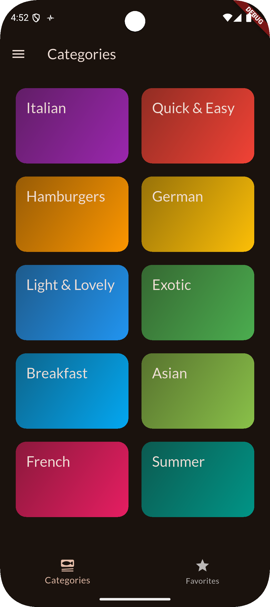
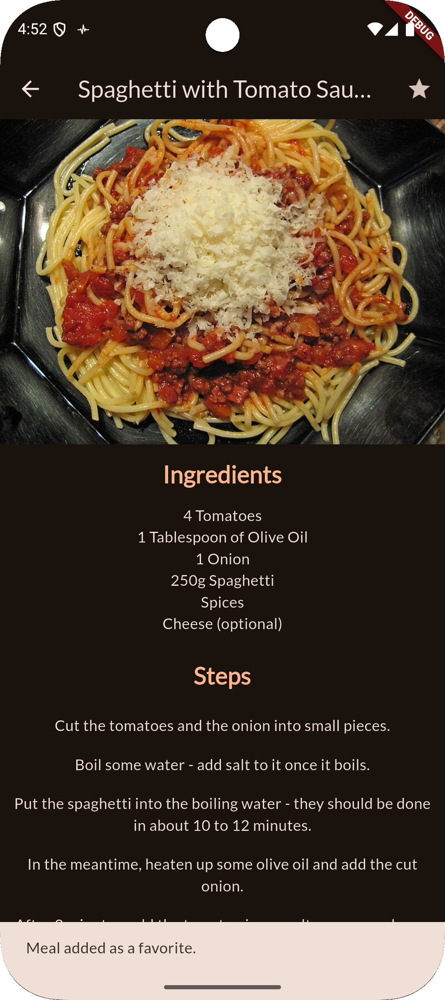
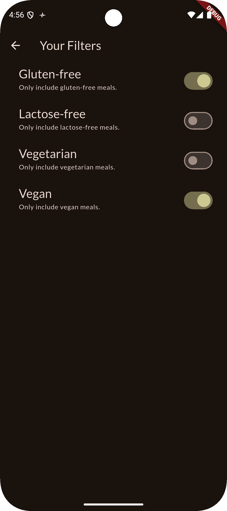

# Flutter Meals Navigator

A Flutter multi-screen meals application demonstrating:
- Category browsing
- Meal details with ingredients and instructions
- Favorites management
- Filters to customize visible meals
- Navigation stack usage (push/pop)
- Bottom tab navigation
- Side drawer navigation

## Features
- Browse meal categories
- View meals within each category
- Open detailed meal pages
- Mark/unmark meals as favorites
- Switch between All Meals and Favorites via tabs
- Apply filters such as gluten-free, lactose-free, vegetarian, vegan
- Persistent navigation using tabs and drawer

## Tech Highlights
- Flutter
- Navigator (push / pop)
- Stateful and stateless widgets
- BottomNavigationBar
- Drawer
- Filtering logic with state management

## Getting Started

This project is a starting point for a Flutter application.

A few resources to get you started if this is your first Flutter project:

- [Lab: Write your first Flutter app](https://docs.flutter.dev/get-started/codelab)
- [Cookbook: Useful Flutter samples](https://docs.flutter.dev/cookbook)

For help getting started with Flutter development, view the
[online documentation](https://docs.flutter.dev/), which offers tutorials,
samples, guidance on mobile development, and a full API reference.

## Screenshots
<table>
  <tr>
    <td align="center"></td>
    <td align="center"></td>
    <td align="center"></td>
  </tr>
  <tr>
    <td align="center"></td>
  </tr>

</table>
